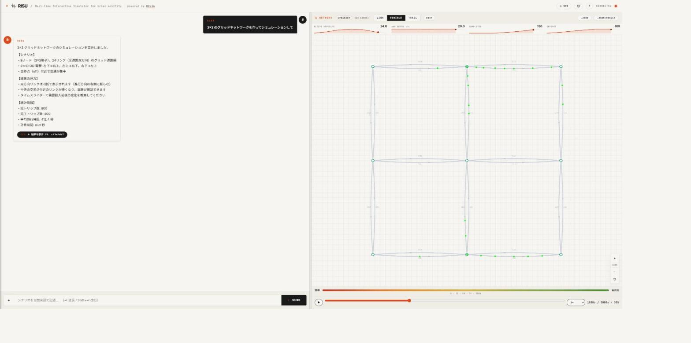
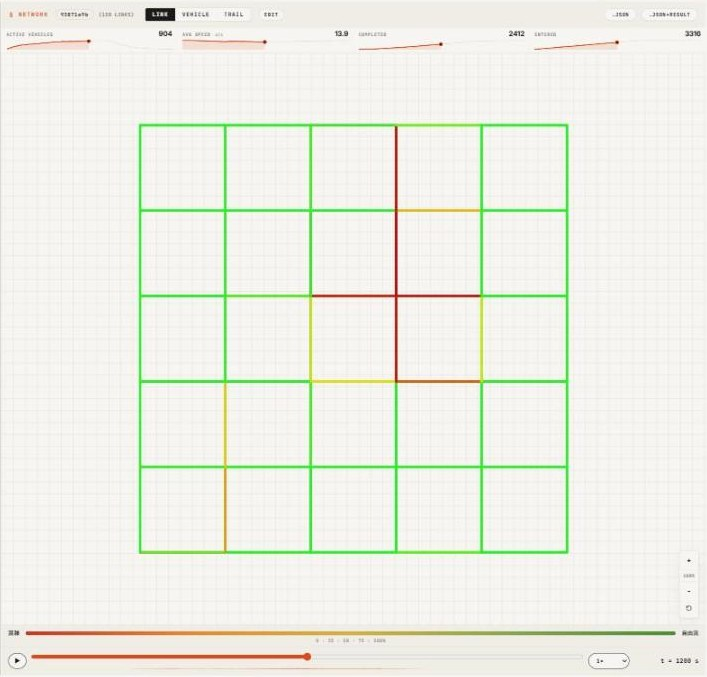
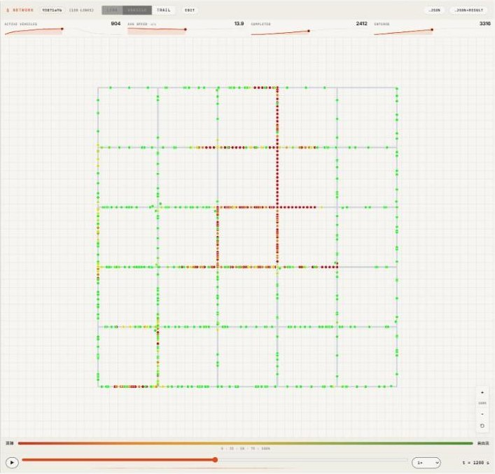
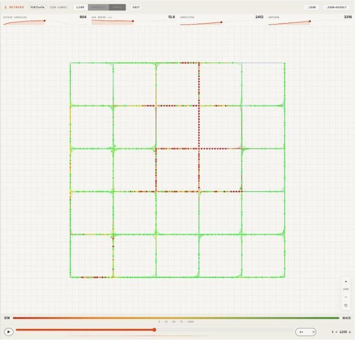
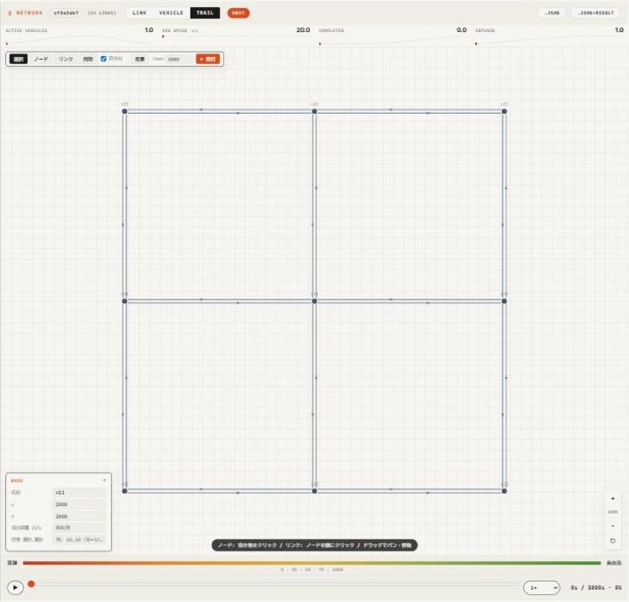

# RISU — Real-time Interactive Simulator for Urban mobility

[](https://github.com/kurumido-org/risu-local/actions/workflows/ci.yml)
[](LICENSE)
[](https://www.python.org/)

交通流シミュレーター [UXsim](https://github.com/toruseo/UXsim) を，ブラウザ上で
LLM と対話しながら操作できるローカルアプリケーションです．



「渋谷駅周辺の道路を取ってきて，朝ピークの渋滞を再現して」と書くと，LLM が
ネットワークを取得し，需要を組み立て，UXsim を実行し，結果を地図とグラフで返します．

- **自然言語でシナリオを設計** — LLM がツールを呼んでシミュレーションを構築・実行
- **3 種類の可視化** — リンク混雑度 / 個車ドット / 軌跡トレイル
- **グラフの自動生成** — LLM が Chart.js の設定を出力してチャット内に描画
- **GUI ネットワークエディタ** — マウスでノード・リンク・需要を編集して即実行
- **データ取込** — CSV / JSON / GMNS / OpenStreetMap
- **MCP エンドポイント** — Claude Code などの MCP クライアントから直接操作
- **素の UXsim へのパイプライン** — 作ったシナリオをサーバー抜きでバッチ実行

すべて手元のマシンで動きます．認証もサーバーへのデータ送信もありません
（LLM に `claude` バックエンドを選んだ場合のみ，ご自身の API キーで Anthropic API を呼びます）．

> **v0.1.0 — ベータ公開です．**
> テストは CI で Windows・Ubuntu × Python 3.10〜3.13 を通っていますが，
> **ブラウザ UI を実際に触って確認したのは Windows 11 / Chrome だけ**です（[詳細](#1-動作環境)）．
> 他の環境で使われた方は，うまくいった / いかなかったのどちらでも
> [Issue](../../issues) で教えていただけると助かります．

> **English**: RISU is a browser-based chat interface for the mesoscopic traffic
> simulator **UXsim**. Describe a scenario in natural language, and the LLM designs,
> runs, and visualizes the simulation — all locally on your machine with your own API key.

---

## 目次

1. [動作環境](#1-動作環境)
2. [セットアップ](#2-セットアップ)
3. [使い方](#3-使い方)
4. [データの取り込み](#4-データの取り込み)
5. [サーバーを使わずに実行する](#5-サーバーを使わずに実行する)
6. [MCP クライアントから使う](#6-mcp-クライアントから使う)
7. [API リファレンス](#7-api-リファレンス)
8. [環境変数](#8-環境変数)
9. [性能とチューニング](#9-性能とチューニング)
10. [トラブルシューティング](#10-トラブルシューティング)
11. [開発](#11-開発)
12. [アーキテクチャ](#12-アーキテクチャ-大規模ネットワークと-llm-の分離)
13. [ライセンス](#13-ライセンス)

---

## 1. 動作環境

**推奨環境は Windows です．**

| 項目 | 要件 |
|---|---|
| OS | **Windows**（推奨）/ **Linux**．どちらも CI でテストが通っています．macOS はサポート対象外 |
| Python | **3.10 / 3.11 / 3.12 / 3.13**（すべて CI で検証） |
| ブラウザ | **Chrome**（検証済み）．Edge / Firefox / Safari も動作する想定 |
| メモリ | 4GB 以上．大規模ネットワーク（5,000 ノード級）を扱うなら 8GB 以上を推奨 |
| ネットワーク | 初回の `pip install` 時．OSM 取込と `claude` バックエンドを使う場合は実行時にも必要 |

<details>
<summary><b>どこまで検証されているか（正確なところ）</b></summary>

| 環境 | 状況 |
|---|---|
| Windows 11 / Python 3.13 / Chrome | **全機能を実機で確認**．セットアップから UI 操作まで |
| Ubuntu / Windows × Python 3.10〜3.13 | **CI でテスト 136 件が通過**．サーバー側の動作は確認済み |
| ブラウザ UI（Chrome 以外 / Linux 上） | **未確認**．CI にブラウザテストは含まれていません |
| macOS | **サポート対象外**．検証の予定もありません |

つまり **サーバー側は複数環境で検証済み，ブラウザ側は Windows / Chrome のみ**という状態です．
UI は素の HTML + Canvas + Chart.js で，OS 固有の API は使っていないので問題は出にくいはずですが，
実際に確かめたわけではありません．

Linux や他のブラウザで使われた方は，結果がどちらでも Issue で教えていただけると助かります．

</details>

LLM バックエンドは 3 つから選べます．**API キーが無くても動作確認はできます**．

| バックエンド | 必要なもの | 用途 |
|---|---|---|
| `mock` | なし | インストール確認，UI の動作確認 |
| `ollama` | ローカルの [Ollama](https://ollama.com/) | 無料・オフライン．ただし小さいモデルでは精度が落ちます |
| `claude` | Anthropic API キー（有料） | 本来の使い方．ツール呼び出しの精度が高い |

---

## 2. セットアップ

### 2.1 リポジトリを取得

```bash
git clone https://github.com/kurumido-org/risu-local.git
cd risu-local
```

### 2.2 Python 仮想環境を作る

プロジェクト専用の環境を作り，システムの Python を汚さないようにします．

<details open>
<summary><b>Windows (PowerShell)</b></summary>

```powershell
python -m venv .venv
.venv\Scripts\activate
```

`activate` が「スクリプトの実行が無効」と拒否される場合は，いちど実行ポリシーを緩めます:

```powershell
Set-ExecutionPolicy -Scope Process -ExecutionPolicy RemoteSigned
.venv\Scripts\activate
```

</details>

<details>
<summary><b>Linux</b></summary>

```bash
python3 -m venv .venv
source .venv/bin/activate
```

</details>

プロンプトの先頭に `(.venv)` が付けば成功です．**以降の作業はすべてこの状態で行います**
（ターミナルを開き直すたびに `activate` が必要です）．

### 2.3 依存パッケージをインストール

```bash
pip install --upgrade pip
pip install -r requirements.txt
```

数分かかります．完了したら確認:

```bash
python -c "import uxsim, fastapi, orjson; print('OK', uxsim.__version__)"
```

<details>
<summary><b>osmnx / geopandas のインストールに失敗する場合</b></summary>

`osmnx` は `geopandas` → `shapely` / `pyproj`（GDAL・GEOS 系のネイティブライブラリ）を
引くため，環境によってはビルドに失敗します．

**OSM 取込を使わないなら，osmnx は無くても構いません．**
RISU は osmnx を遅延 import しており，入っていなくてもサーバーは起動し，
`import_osm_network` 以外のすべての機能が動きます．

`requirements.txt` から `osmnx` の行を除いてインストールしてください:

```bash
pip install fastapi "uvicorn[standard]" orjson zstandard python-multipart python-dotenv anthropic httpx mcp uxsim
```

後から追加したくなったら，conda を使うと確実です:

```bash
conda install -c conda-forge osmnx
```

</details>

<details>
<summary><b>Windows で「No such file or directory」が出てインストールが止まる</b></summary>

`anthropic` パッケージには非常に長いファイル名が含まれており，**Windows の
260 文字パス長制限**に当たることがあります．エラーはこんな形になります:

```
ERROR: Could not install packages due to an OSError: [Errno 2]
No such file or directory: 'C:\...\site-packages\anthropic\types\beta\beta_managed_...py'
```

対処は次のいずれかです．

1. **浅い場所にクローンする** — `C:\risu-local` のようにパスを短くする（最も確実）
2. **長いパスを有効にする** — 管理者権限の PowerShell で:

   ```powershell
   Set-ItemProperty -Path "HKLM:\SYSTEM\CurrentControlSet\Control\FileSystem" `
     -Name LongPathsEnabled -Value 1
   ```

   再起動後に有効になります．

</details>

<details>
<summary><b>正確に同じバージョンを再現したい場合（論文の追試・バグ報告）</b></summary>

```bash
pip install -r requirements.lock.txt
```

`requirements.txt` は範囲指定（上限付き），`requirements.lock.txt` は動作確認済みの
正確なバージョンです．

</details>

### 2.4 C++ バックエンドの確認

UXsim 1.14 以降は C++ バックエンドを搭載しており，シミュレーション実行が
純 Python 実装の **10〜20 倍** 高速です．`requirements.txt` は 1.14 系を取得するので，
通常はそのまま有効になっています．

確認:

```bash
python -c "from uxsim import World; W=World(name='t',tmax=10,deltan=5,print_mode=0,save_mode=0,show_mode=0,cpp=True); print('C++ backend OK')"
```

`C++ backend OK` と出れば有効です．`TypeError` が出る場合は古い UXsim（1.13 以前）で，
純 Python 実装にフォールバックします．RISU は自動で切り替えるので動作はしますが，
大きなネットワークでは差が大きいので更新を推奨します:

```bash
pip install -U "uxsim>=1.14,<2"
```

### 2.5 LLM バックエンドを選ぶ

`.env.example` をコピーして `.env` を作ります．

```bash
# Windows
copy .env.example .env
# Linux
cp .env.example .env
```

`.env` は `.gitignore` 済みで，コミットされません．以下から 1 つ選んで編集します．

---

#### (a) まず動かしてみる — `mock`

**API キー不要．** キーワードに反応して用意済みのシナリオを実行するだけの
ダミー LLM です．インストールが正しいかの確認に使ってください．

```ini
LLM_BACKEND=mock
```

「ボトルネック」「グリッド」などの語に反応します．

---

#### (b) ローカル LLM — `ollama`

**無料・オフライン．** ただし小さいモデルではツール呼び出しの精度が落ち，
複雑な指示は通らないことがあります．

1. [Ollama](https://ollama.com/) をインストール
2. モデルを取得して常駐させる:

   ```bash
   ollama pull qwen2.5:3b
   ollama serve
   ```

3. `.env`:

   ```ini
   LLM_BACKEND=ollama
   ```

既定のモデルは `qwen2.5:3b`，接続先は `http://localhost:11434` です．
変更する場合は `server.py` の `OLLAMA_MODEL` / `OLLAMA_BASE_URL` を編集してください．

---

#### (c) Claude API — `claude`（本来の使い方）

ツール呼び出しが安定しており，RISU の機能をすべて引き出せます．**従量課金** です．

1. [Anthropic Console](https://console.anthropic.com) で API キーを発行
2. `.env`:

   ```ini
   LLM_BACKEND=claude
   ANTHROPIC_API_KEY=sk-ant-...
   ```

コストの目安は，1 ターンあたり数円程度です．チャットの吹き出し下に
`tokens in ... + cached ... · out ... · ≈¥...` として**実際の使用量と概算費用が表示される**ので，
そこで確認してください．プロンプトキャッシュが効くよう設計されているため，
同じ会話を続けるほど 1 ターンあたりの費用は下がります．

### 2.6 起動

```bash
python server.py
```

以下が表示されれば成功です:

```
INFO:     Uvicorn running on http://127.0.0.1:8001 (Press CTRL+C to quit)
[RISU] http://localhost:8001
```

ブラウザで **http://localhost:8001** を開きます．
右上のドットが緑になり `CONNECTED` と表示されれば接続成功です．

停止は `Ctrl+C` です．

> **ポートを変えたい場合**: `RISU_PORT=8080 python server.py`（Windows は `$env:RISU_PORT=8080`）．
>
> **既定ではこのマシンからのみ接続できます**（`127.0.0.1` で待ち受け）．
> RISU は認証を持たないため，別のマシンから使いたい場合は
> [`RISU_HOST`](#8-環境変数) の注意書きを読んでから設定してください．

### 2.7 動作確認

チャット欄に次を入力して `Enter`:

```
単純なボトルネック道路を作って
```

右側にネットワークが表示され，緑や赤の点（車両）が動けば，セットアップは完了です．

---

## 3. 使い方

### 3.1 画面の構成

```
  ┌ ヘッダ ────────────────────────────────── ＋NEW  🕘  ?  CONNECTED ● ┐
  ├─────────────────────────┬──────────────────────────────────────────┤
  │                         │ ⑧ ffb44598 (2 LINKS) LINK VEHICLE TRAIL  │
  │                         │   EDIT            .json  .json+result    │
  │      ① チャット          ├──────────────────────────────────────────┤
  │                         │ ⑨ ACTIVE  AVG SPEED  COMPLETED  ENTERED  │
  │   入力した指示            │    46.0     6.7        50.0      96.0    │
  │   RISU の応答            ├──────────────────────────────────────────┤
  │   ③ 生成されたグラフ      │                                     ⑪ ＋ │
  │   ④ SIM バッジ           │      ⑩ ネットワーク表示（Canvas）      100%│
  │                         │                                       −  │
  │                         │                                       ⟲  │
  │                         ├──────────────────────────────────────────┤
  │                         │ ⑫ 混雑 ▬▬▬▬▬▬▬▬ 自由流                  │
  ├─────────────────────────┤ ⑬ ▶ ──●──────────  1×  1116s/2000s・56% │
  │ ② ＋  入力欄     [SEND]  │      ‧‧‧‧‧‧‧‧‧ ⑭ 混雑度の推移             │
  └─────────────────────────┴──────────────────────────────────────────┘
                            ↑ ⑦ 境界をドラッグして幅を変更
```

| | 要素 | 説明 |
|---|---|---|
| ① | チャット | 指示と応答．`claude` バックエンドでは応答の下に**トークン使用量と概算費用**が小さく表示されます |
| ② | **＋** / 入力欄 / **SEND** | ＋ でファイル添付．生成中は SEND が **STOP**（中止）に変わります |
| ③ | グラフ | ホバーすると **PNG**（画像保存）と **OPEN**（新しいタブで拡大）が出ます |
| ④ | SIM バッジ | クリックでその結果を再表示 |
| ⑤ | **＋NEW** | 会話をリセット（`Ctrl`/`Cmd` + `K`） |
| ⑥ | **🕘** | 会話履歴．過去のシミュレーションを開き直せます |
| ⑦ | 境界線 | ドラッグで左右パネルの幅を変更 |
| ⑧ | ツールバー | `sim_id`（**クリックでコピー**）／描画モード／EDIT／ダウンロード |
| ⑨ | 統計バー | 走行中台数・平均速度・到着台数・流入台数．時刻に連動 |
| ⑩ | Canvas | ネットワーク表示．操作は [3.3](#33-結果を見る) |
| ⑪ | ズーム | **＋** / **−** で拡大縮小，**⟲** でカメラをリセット |
| ⑫ | 凡例 | 色と混雑度の対応 |
| ⑬ | タイムライン | **▶** 再生（`Space`）／スライダーで時刻移動／`1×` で再生速度 |
| ⑭ | 推移 | 時間ごとの混雑度．どこで詰まり始めたかの当たりを付けられます |

右上の **?** ボタンでヘルプ（例文とキーボード操作の一覧）が開きます（`Esc` で閉じる）．

> **画面が狭いとき**: 幅が足りない環境では上部に **CHAT** / **VIEW** の切り替えタブが出て，
> チャットとネットワーク表示を 1 画面ずつ表示します．

### 3.2 チャットで指示する

自然言語で書けば，LLM がツールを呼び出してシミュレーションを実行します．

**ネットワークを作る**

```
単純なボトルネック道路を作って渋滞をシミュレーションして
5×5 のグリッドネットワークを作って，周縁から流入する需要を入れて
片側 2 車線の道路が 1 車線に絞られる区間を作って
信号のある 4 枝交差点を作って，東西を 60 秒・南北を 30 秒の青にして
```

**実在の場所を取り込む**

```
渋谷駅周辺を OSM から取得してシミュレーションして
新宿駅から半径 2km の幹線道路だけでシミュレーションして
```

**条件を変えて比べる**

```
さっきのネットワークで，リンク r1 の容量を半分にして再実行して
車線を 2 倍にして比較して
需要を 1 時間前倒しして，ピークが分散するか見せて
```

**分析する**

```
結果を速度の時系列グラフで見せて
どこで渋滞が起きているか教えて
混雑している上位 5 リンクを表で出して
```

> **ヒント**: 一度実行したネットワークの修正は，全体を作り直さず**差分だけ**が
> サーバーに送られます．「〜を変えて」と続けて指示するのが最も速く，確実です．

**生成を止める・やり直す**

- 応答の生成中は **SEND** ボタンが **STOP** に変わります．押すとその場で中断します
  （課金も止まります）．
- エラーで失敗したときは，メッセージの横に **RETRY** ボタンが出ます．
  押すと直前の指示がそのまま入力欄に戻り，再送されます．
- 会話をやり直したいときは右上の **＋NEW**（`Ctrl`/`Cmd` + `K`）．
  過去の会話は **🕘**（履歴）から開き直せます．

### 3.3 結果を見る

**描画モード**（右上で切り替え）

| モード | 表示内容 | 向いている用途 |
|---|---|---|
| **LINK** | 道路を混雑度で色分け（緑=自由流 → 赤=渋滞） | 全体のどこが詰まっているかの俯瞰 |
| **VEHICLE** | 車両を 1 台ずつドットで表示 | 車両の動きを直感的に追う |
| **TRAIL** | 車両の軌跡を線で残す | 経路の偏り・迂回の把握 |

同じシミュレーション（6×6 格子，中央 4 リンクの容量を絞ったもの）を 3 モードで見た例です．
中央の赤い十字が容量を絞った区間で，そこから渋滞が上流へ伸びているのが分かります．

| LINK | VEHICLE | TRAIL |
|---|---|---|
|  |  |  |

**タイムライン**

下部のスライダーで時刻を移動します．`▶` で再生，`1×` のセレクトで再生速度を変更．
スライダー下の小さな波形は，時間ごとの混雑度の推移です．

**統計バー**

`ACTIVE VEHICLES`（走行中台数）/ `AVG SPEED`（平均速度）/ `COMPLETED`（到着台数）/
`ENTERED`（流入台数）が，時刻に連動して更新されます．

**マウス操作**

- **ドラッグ** — 地図を移動（パン）
- **ホイール** — ズーム
- **リンクにホバー** — そのリンクの名前・速度・台数をツールチップ表示
- **右下の ⟲** — カメラをリセット

### 3.4 キーボードショートカット

| キー | 動作 |
|---|---|
| `Enter` | メッセージ送信 |
| `Shift` + `Enter` | 改行 |
| `Ctrl` / `Cmd` + `K` | 新しい会話を開始 |
| `Space` | 再生 / 一時停止（入力欄にフォーカスが無いとき） |
| `Esc` | モーダル・履歴パネルを閉じる |
| `Delete` / `Backspace` | 選択中の要素を削除（エディタ編集モード時） |

### 3.5 GUI ネットワークエディタ

右パネル上部の **EDIT** ボタンで編集モードに入ります．



**編集対象**は現在表示中のシナリオです．チャットや OSM で作ったネットワークの手直しもできますし，
何も表示していなければ白紙から作れます．

| ツール | 操作 |
|---|---|
| **選択** | クリックで選択．ドラッグでノードを移動（接続リンクの延長は自動で再計算） |
| **ノード** | クリックした位置にノードを追加 |
| **リンク** | 始点→終点の順にクリック．連続作成可．「双方向」にチェックすると逆方向も同時に作成 |
| **削除** | クリックで削除（`Delete` キーでも可） |

プロパティパネルで編集できる項目:

- **ノード** — 名前 / 座標 / 流出容量（交差点の処理能力, 台/s）/ 信号（各現示の青時間リスト）
- **リンク** — 名前 / 延長 / 自由流速度 / 車線数 / **容量（台/s）** / 信号 group

「**需要**」ボタンで OD 需要（出発地・目的地・時間帯・流量）を編集し，
ツールバー右の **tmax**（シミュレーション終了時刻，秒）を設定して
「**▶ 実行**」でそのままシミュレーションできます．

編集モードを抜けるには，もう一度 **EDIT** を押します．

> **双方向道路について**: UXsim ではすべてのリンクが一方通行です．双方向道路は
> A→B と B→A の 2 本で表現します（画面上は円弧で描き分けられます）．

### 3.6 結果の保存

ツールバー右上の 2 つのボタンでダウンロードできます．

| ボタン | 内容 | 用途 |
|---|---|---|
| **.json** | シナリオのみ（ノード・リンク・需要） | 再現用．軽量．`scripts/run_scenario.py` にそのまま渡せます |
| **.json+result** | シナリオ + 全結果（GeoJSON・個車フレーム・統計） | 完全なアーカイブ．大規模だと数十 MB になります |

チャット履歴は左上の履歴ボタンから参照でき，ブラウザの localStorage に保存されます．

> **注意**: シミュレーション結果はサーバーのメモリ上にあり，**`python server.py` を
> 再起動すると消えます**（既定で最新 30 件まで保持）．残したい結果は
> `.json` / `.json+result` でダウンロードしてください．

---

## 4. データの取り込み

### 4.1 CSV / JSON ファイル

入力欄左の **+** ボタンでファイルを添付します．
[CSV サンプル](static/sample_risu.csv) をダウンロードして形を確認できます．

**RISU 形式の CSV** — `type` 列で行の種類を区別します:

```csv
type,name,x,y,start,end,length,free_flow_speed,number_of_lanes,orig,dest,t_start,t_end,flow
node,start,0,0,,,,,,,,,,
node,neck,5000,0,,,,,,,,,,
node,goal,7500,0,,,,,,,,,,
link,road1,,,start,neck,5000,20,1,,,,,
link,road2,,,neck,goal,2500,10,1,,,,,
demand,,,,,,,,,start,goal,0,600,0.8
```

| 行の種類 | 必要な列 | 任意の列 |
|---|---|---|
| `node` | `name`, `x`, `y` | — |
| `link` | `name`, `start`, `end` | `length`（既定 1000 m）, `free_flow_speed`（既定 20 m/s）, `number_of_lanes`（既定 1）, `capacity`（台/s） |
| `demand` | `orig`, `dest`, `t_start`, `t_end`, `flow` | — |

> **CSV で設定できないもの**: ノードの流出容量（`flow_capacity`）と信号（`signal`），
> リンクの信号 group は CSV では読み込まれません．これらを使う場合は，
> JSON で渡すか，取り込んだ後に GUI エディタまたはチャットで設定してください．

列名は**別名も認識**します（大文字小文字は無視）:

- 座標: `x` / `x_coord` / `lon` / `longitude`（`y` も同様）
- 始点: `start` / `from` / `from_node_id` / `source`
- 終点: `end` / `to` / `to_node_id` / `target`
- 速度: `free_flow_speed` / `speed` / `speed_limit` / `ffs`
- 車線: `number_of_lanes` / `lanes` / `num_lanes`
- 流量: `flow` / `volume` / `demand` / `rate`

**単位**

| 項目 | 単位 |
|---|---|
| 座標 `x`, `y` | メートル |
| 延長 `length` | メートル |
| 速度 `free_flow_speed` | **m/s**（60 km/h なら 16.7） |
| 容量 `capacity` | **台/秒**（1,800 台/時なら 0.5） |
| 時刻 `t_start`, `t_end` | 秒（シミュレーション開始からの経過） |
| 流量 `flow` | 台/秒 |

> 大きいファイル（20KB 超）は LLM のメッセージに埋め込まず，直接シミュレーションに
> 渡されます．LLM には `sim_id` と統計だけが伝わるので，数万行の CSV でも扱えます．

### 4.2 OpenStreetMap

チャットで実在の地名を挙げるだけで取り込めます．

```
渋谷駅周辺を OSM から取得してシミュレーションして
```

取得する道路の種類は，チャットで「主要道路だけ」「幹線道路で」のように指定するか，
API の `road_types` パラメータで選べます:

| 値 | 内容 | 用途 |
|---|---|---|
| `major` | 高速道路・国道級のみ | 広域（半径 2km 以上）でも軽い |
| `arterial` | 幹線道路まで | 都市スケールの標準 |
| `drive` | 一般車道（**既定**） | 住宅街の道路を含む．サービス道路は除外 |
| `all` | 全車道 | 駐車場内通路まで．狭い範囲向け |

> **半径 1km 以上なら `arterial` か `major` を使ってください．** 細街路込みで広範囲を
> 取ると数千ノードになり，計算がタイムアウトします（システムプロンプトで LLM にも
> 指示済みですが，明示するとより確実です）．

取得したデータは `./cache` にキャッシュされ，同じ地名の 2 回目以降は高速です．
キャッシュ先は `RISU_OSM_CACHE_DIR` で変更できます．

> **ライセンス**: OSM データは ODbL です．取得したネットワークや結果を公開する場合は
> 帰属表示（© OpenStreetMap contributors）が必要です．

### 4.3 GMNS

[GMNS](https://github.com/zephyr-data-specs/GMNS) 形式のデータセットを取り込めます．

```bash
curl http://localhost:8001/gmns/datasets          # 利用可能な一覧
```

UI からは，チャットで「GMNS の〜を読み込んで」と指示します．

---

## 5. サーバーを使わずに実行する

対話で組み立てたシナリオを，**RISU を介さずローカルの Python + UXsim だけで**実行できます．
バッチ実験，パラメータスタディ，論文用の後処理につなぐための経路です．

`scripts/run_scenario.py` は FastAPI も LLM も import しません（CI が uxsim だけを
入れた環境で毎回検証しています）．

### 5.1 シナリオを実行する

```bash
# ファイルから実行して統計を表示
python scripts/run_scenario.py scenario.json --analysis

# 起動中の RISU から取り出して実行（サーバーは取得にしか使いません）
python scripts/run_scenario.py --sim-id 6c49d38a --analysis
```

出力例:

```
========================================================
  bottleneck
========================================================
  ネットワーク : 3 ノード / 2 リンク / 1 需要
  tmax         : 2000 s   deltan: 5
  計算時間     : 0.08 s
results:
 average speed:  9.5 m/s
 number of completed trips:  480 / 480
 average travel time of trips:  792.6 s
 delay ratio:   0.369
```

入力に使える JSON は次のいずれでも構いません（自動で判別します）:

- UI の **.json** ボタンでダウンロードしたファイル
- `GET /results/<id>/scenario` の応答
- シナリオそのもの（`{"nodes": [...], "links": [...], "demands": [...]}`）

### 5.2 UXsim 標準の CSV を書き出す

```bash
python scripts/run_scenario.py scenario.json --csv out/
```

`out/` に `vehicles.csv`（車両軌跡）・`links.csv`（リンク集計）・`basic.csv`・`od.csv`
が出力されます．

### 5.3 単体で動く Python スクリプトを生成する

```bash
python scripts/run_scenario.py scenario.json --emit my_experiment.py
python my_experiment.py
```

生成されるスクリプトは **uxsim だけあれば動きます**（RISU も FastAPI も不要）．
ネットワークと需要がベタ書きされているので，そのまま編集して条件を振れます:

```python
W = build()
W.exec_simulation()
W.analyzer.print_simple_stats()
W.analyzer.macroscopic_fundamental_diagram()
W.analyzer.time_space_diagram_traj_links([["road1", "road2"]])
W.analyzer.vehicles_to_pandas().to_csv("vehicles.csv", index=False)
```

### 5.4 オプション一覧

| オプション | 説明 |
|---|---|
| `--sim-id ID` | 起動中の RISU から取得（`--url` で場所を指定，既定 `http://localhost:8001`） |
| `--analysis` | UXsim の `basic_analysis` を有効にして集計統計も出す |
| `--csv DIR` | UXsim 標準の CSV を書き出す（`--analysis` を含む） |
| `--emit OUT.py` | 単体で動くスクリプトを生成（実行はしない） |
| `--no-cpp` | C++ バックエンドを使わず純 Python で実行 |

> `--analysis` / `--csv` は内部で `save_mode=1` にします．`basic_analysis` は
> 全点対最短路 O(N³) を計算するため，ノード数が多いと重くなります．
> 統計が不要なら付けないでください．

---

## 6. MCP クライアントから使う

RISU は MCP（Model Context Protocol）の SSE エンドポイントを持っており，
Claude Code などのクライアントから直接シミュレーションを実行できます．

サーバーを起動した状態で，クライアント側に次を登録します:

```
http://localhost:8001/mcp
```

Claude Code の場合:

```bash
claude mcp add --transport sse risu http://localhost:8001/mcp
```

提供されるツール:

| ツール | 説明 |
|---|---|
| `run_simulation` | ノード・リンク・需要を指定してシミュレーションを実行 |
| `get_result` | 実行済みの結果を `simulation_id` で取得 |

結果はブラウザ側にも反映されるので，MCP で実行して UI で眺める，という使い方もできます．

---

## 7. API リファレンス

対話的なドキュメントは **http://localhost:8001/docs**（Swagger UI）にあります．

| Method | Path | 説明 |
|---|---|---|
| `POST` | `/simulate` | シミュレーションを直接実行．`{"id": "...", "stats": {...}}` を返す |
| `GET` | `/results/{id}` | 完全な結果（GeoJSON + 個車フレーム + 統計）．zstd / gzip を Accept-Encoding で交渉 |
| `GET` | `/results/{id}/scenario` | 再現用のシナリオのみ（軽量） |
| `POST` | `/chat` | LLM チャット（ツール自動呼び出し，SSE ストリーミング） |
| `POST` | `/upload` | CSV / JSON からシミュレーション実行 |
| `POST` | `/import/osm` | OpenStreetMap 取込（`place`, `distance_m`, `road_types`, `tmax`） |
| `GET` | `/gmns/datasets` | GMNS データセット一覧 |
| `POST` | `/gmns/import` | GMNS 取込 |
| `GET` | `/mcp` | MCP SSE エンドポイント |
| `GET` | `/healthz` | ヘルスチェック |
| `GET` | `/docs` | Swagger UI |

**`POST /simulate` の例**

```bash
curl -X POST http://localhost:8001/simulate \
  -H "Content-Type: application/json" \
  -d '{
    "name": "bottleneck",
    "tmax": 2000,
    "deltan": 5,
    "nodes": [
      {"name": "start", "x": 0,    "y": 0},
      {"name": "neck",  "x": 5000, "y": 0, "flow_capacity": 0.4},
      {"name": "goal",  "x": 7500, "y": 0}
    ],
    "links": [
      {"name": "road1", "start": "start", "end": "neck", "length": 5000},
      {"name": "road2", "start": "neck",  "end": "goal", "length": 2500, "free_flow_speed": 10}
    ],
    "demands": [
      {"orig": "start", "dest": "goal", "t_start": 0, "t_end": 600, "flow": 0.8}
    ]
  }'
```

**シナリオのパラメータ**

| フィールド | 既定値 | 説明 |
|---|---|---|
| `name` | `"sim"` | シミュレーション名 |
| `tmax` | `3600` | 終了時刻（秒） |
| `deltan` | `5` | 車両集計単位（1 台のドットが何台を表すか．小さいほど精密で重い） |
| `reaction_time` | UXsim 既定 | 車頭時間（秒）．1.5〜1.7 で高速道路の実勢容量（1,800〜2,000 台/時/車線）に近づく |

---

## 8. 環境変数

`.env` に書くか，シェルの環境変数として設定します．すべて省略可能です
（`LLM_BACKEND=claude` のときの `ANTHROPIC_API_KEY` を除く）．

### LLM

| 変数 | 既定値 | 説明 |
|---|---|---|
| `LLM_BACKEND` | `claude` | `claude` / `ollama` / `mock` |
| `ANTHROPIC_API_KEY` | — | `claude` バックエンド時に必須 |
| `RISU_MAX_TOOL_ROUNDS` | `3` | LLM の tool_use ループ最大回数（暴走・コスト対策） |
| `RISU_MAX_HISTORY_CHARS` | `24000` | LLM に送る会話履歴の文字数予算．超過時は古いターンから落とす（`0` で無制限） |
| `RISU_CACHE_TTL` | `5m` | Prompt Caching の TTL（`5m` / `1h`）．操作の間隔が 5 分以上空くことが多ければ `1h` |

### リソース上限

| 変数 | 既定値 | 説明 |
|---|---|---|
| `RISU_MAX_NODES` | `50000` | ノード数の上限 |
| `RISU_MAX_LINKS` | `100000` | リンク数の上限 |
| `RISU_MAX_DEMANDS` | `10000` | 需要数の上限 |
| `RISU_MAX_TMAX` | `86400` | シミュレーション時間の上限（秒） |
| `RISU_UXSIM_TIMEOUT` | `120` | UXsim 実行のタイムアウト（秒）．大規模網では伸ばす |
| `RISU_MAX_UPLOAD_BYTES` | `10485760` | アップロード上限（10MB） |
| `RISU_MAX_RESULTS` | `30` | メモリに保持する結果の件数．超えると古い順に破棄 |

### 可視化・転送

| 変数 | 既定値 | 説明 |
|---|---|---|
| `RISU_MAX_FRAMES` | `200` | 可視化フレーム数の上限（時刻方向の間引き） |
| `RISU_MAX_FRAME_POINTS` | `3000000` | 描画用の総車両点数の上限．超過時は車両を等間隔サンプリング（`0` で無効）．**統計と時系列は間引き前の全点から計算されるので影響を受けません** |
| `RISU_RESULTS_ZSTD_LEVEL` | `3` | `/results` の zstd 圧縮レベル |
| `RISU_RESULTS_GZIP_LEVEL` | `1` | `/results` の gzip 圧縮レベル（zstd 非対応クライアント向け） |

### 待ち受け・その他

| 変数 | 既定値 | 説明 |
|---|---|---|
| `RISU_HOST` | `127.0.0.1` | 待ち受けアドレス．**既定はこのマシンからのみ接続可**（下記の注意を参照） |
| `RISU_PORT` | `8001` | 待ち受けポート |
| `RISU_RELOAD` | `false` | 開発用のオートリロード．`1` で有効 |
| `RISU_OSM_CACHE_DIR` | `./cache` | OSM 取得結果のキャッシュ先 |
| `RISU_ALLOWED_ORIGINS` | localhost | CORS の許可オリジン（カンマ区切り） |

> ⚠️ **`RISU_HOST` を変更する前に**
>
> RISU は**認証を持ちません**（ローカル利用を前提とした設計です）．
> `RISU_HOST=0.0.0.0` にすると同じネットワークの誰でも接続でき，
>
> - シミュレーションを実行できる（CPU を消費される）
> - 保存済みの結果をすべて読める
> - `/chat` を叩ける = **あなたの API キーで課金が発生する**
>
> 状態になります．別のマシンから使う必要がある場合だけ，信頼できるネットワークで
> 明示的に設定してください（設定すると起動時に警告が出ます）．

---

## 9. 性能とチューニング

### 既定で有効な最適化

- **C++ バックエンド**（uxsim 1.14+）— 純 Python 比 10〜20 倍
- **結果の圧縮転送** — zstd で転送量を非圧縮比 1/11 に（2.4M 点で 64MB → 5.6MB）
- **後処理の numpy ベクトル化** — 車両ごとの Python ループを持たない
- **描画の最適化** — 静的レイヤーのキャッシュ，TypedArray バッファ，色の量子化
  （車両 12,000 台で 1 フレーム 0.2ms．60fps の予算 16.7ms に対して十分な余裕）
- **OSM キャッシュ** — 同じ地名の 2 回目以降は取得をスキップ

### 重いと感じたら

| 症状 | 対処 |
|---|---|
| シミュレーションがタイムアウトする | `RISU_UXSIM_TIMEOUT` を伸ばす / `deltan` を大きくする / OSM の `road_types` を `arterial` にする |
| ブラウザが重い・固まる | `RISU_MAX_FRAME_POINTS` を下げる（描画用の車両を間引くだけで，統計には影響しません） |
| メモリを使いすぎる | `RISU_MAX_RESULTS` を下げる（1 件で数十 MB になり得ます） |
| OSM 取込が終わらない | 半径を小さくするか `road_types` を `major` / `arterial` に |

### ベンチマーク

性能上の前提を壊していないか確認するためのスクリプトを同梱しています．

```bash
python scripts/bench.py                      # 10x10, 20x20, 40x40
python scripts/bench.py --sizes 20           # 20x20 だけ
python scripts/bench.py --sizes 20 --profile # cProfile 付き
```

---

## 10. トラブルシューティング

<details>
<summary><b>右上のドットが赤いまま / CONNECTING から変わらない</b></summary>

`python server.py` が起動しているか確認してください．
ターミナルにエラーが出ていないか，`http://localhost:8001/healthz` が
`{"status":"ok"}` を返すかを見ます．

ポート 8001 が他のプロセスに使われている可能性もあります:

```bash
# Windows
netstat -ano | findstr :8001
# Linux
lsof -i :8001
```

</details>

<details>
<summary><b>別の PC / スマホから開けない</b></summary>

**仕様どおりです．** RISU は既定で `127.0.0.1`（このマシンのみ）で待ち受けます．
認証を持たないため，既定で外部に開くのは危険だからです．

同じネットワークの他の端末から使いたい場合は，**信頼できるネットワークであることを
確認したうえで**次のように起動します．

```powershell
$env:RISU_HOST = "0.0.0.0"
python server.py
```

起動時に警告が表示されます．接続先は `http://<このPCのIP>:8001` です．
Windows ファイアウォールの許可も必要になることがあります．

**同じネットワークにいる全員が，あなたの API キーで LLM を呼べる状態になります．**
共有 Wi-Fi では使わないでください．

</details>

<details>
<summary><b>「Anthropic API キーが無効です」と出る</b></summary>

`.env` の `ANTHROPIC_API_KEY` を確認してください．よくある原因:

- `.env` を作っていない（`.env.example` のままになっている）
- キーの前後に余分な空白や引用符が入っている
- `.env` を編集した後，サーバーを再起動していない

まず `LLM_BACKEND=mock` にして，キー以外の部分が動くか切り分けると早いです．

</details>

<details>
<summary><b>LLM が「実行します」と言うだけで何も起きない</b></summary>

ツール呼び出しが行われていません．`ollama` バックエンドの小さいモデルで起きやすい現象です．
`claude` バックエンドを使うか，「run_simulation を使って実行して」のように明示してください．

</details>

<details>
<summary><b>シミュレーションは終わるのに車が動かない / 台数が 0</b></summary>

需要（demand）が入っていない，または OD が接続されていない可能性があります．
「需要を追加して」と指示するか，エディタの「需要」ボタンで確認してください．

リンクはすべて**一方通行**です．A→B のリンクしか無いと B→A の需要は流れません．

</details>

<details>
<summary><b>容量を設定したのに渋滞しない</b></summary>

**リンクの終点ノードがそのまま目的地（demand の `dest`）の場合，`capacity` は作用しません**
（車両が境界を通過せず到着・消滅するため）．ボトルネックを見せたい場合は，
その下流にもう 1 本リンクを置いて目的地を先に延ばしてください．

</details>

<details>
<summary><b>結果が消えた</b></summary>

結果はサーバーのメモリ上にあり，**再起動すると消えます**．また `RISU_MAX_RESULTS`
（既定 30）を超えると古いものから破棄されます．
残したい結果は **.json** / **.json+result** でダウンロードしてください．

</details>

<details>
<summary><b>OSM 取込が「地名が見つかりません」になる</b></summary>

ジオコーディング（Nominatim）が地名を解決できていません．
「渋谷駅」より「Shibuya Station, Tokyo」のように具体的に書くか，
より一般的な地名を試してください．Nominatim にはレート制限があるため，
連続で叩くと一時的に失敗することもあります．

</details>

<details>
<summary><b>グラフが表示されない</b></summary>

Chart.js を CDN から読み込んでいるため，**オフラインだとグラフだけが描画されません**
（シミュレーション自体は動きます）．

</details>

---

## 11. 開発

```bash
pip install -r requirements-dev.txt

pytest tests/ -v        # テスト
ruff check .            # lint（CI と同じ設定）
python scripts/bench.py # 性能ベンチ
```

CI（GitHub Actions）は次の 4 ジョブを定義しています:

| ジョブ | 内容 |
|---|---|
| `lint` | `ruff check` |
| `test` | `pytest`（Ubuntu / Windows × Python 3.10〜3.13 の 8 通り） |
| `licenses` | 新しいコピーレフト依存が入っていないかの検査 |
| `standalone` | uxsim だけの環境で `scripts/run_scenario.py` が動くかの検証 |

`schedule` で毎週も走ります．RISU は uxsim の内部 API に依存した高速化を持つため
（[CLAUDE.md §3.6](CLAUDE.md#36-後処理に車両ごとの-python-ループを持たない)），
新しい uxsim が出たときに push が無くても気づけるようにしてあります．

開発の指針・設計上の不変条件は [CLAUDE.md](CLAUDE.md) にまとめてあります．
特に**性能とトークン効率に関する前提**は，変更前に目を通してください．

不具合の報告やご質問は [Issue](../../issues) へお願いします．
**とくにブラウザ UI を Linux や Chrome 以外で使った報告が助かります**
（そこだけ CI では確認できないためです）．
報告の書き方は [CONTRIBUTING.md](CONTRIBUTING.md) にあります．

---

## 12. アーキテクチャ: 大規模ネットワークと LLM の分離

RISU は数千〜1万リンク級のネットワークを扱いますが，**LLM にネットワーク実体を渡しません**．
LLM が扱うのは「ID・差分・要約・パラメトリック命令」だけで，データ実体は常に
サーバー側（`results_store`）に置かれます．LLM のコンテキスト・出力サイズ制限と
無関係にネットワーク規模をスケールさせるための設計です．

### ① 入力側 — ネットワークが LLM に入らない

| 経路 | 仕組み |
|---|---|
| 実行済みシナリオ | サーバーに保存され，LLM は `sim_id`（8文字）で参照する |
| チャット添付（>20KB） | メッセージに埋め込まず `/upload` で直接実行．LLM には sim_id + 統計の 1 行だけが渡る（小さいファイルは従来通り埋め込み，LLM が中身を読める） |
| OSM / GMNS 取込 | LLM が送るのは地名・半径・道路種別等のパラメータのみ．構築はサーバーが行う |
| 毎ターンのコンテキスト | sim_id・件数・リンク名サンプル 20 個・rerun の使い方のみを注入 |

### ② 操作側 — ネットワークが LLM から出ない

| 操作 | 仕組み |
|---|---|
| 修正・再実行 | `rerun_simulation(base_sim_id, modifications)`．「リンク r1 の容量を 0.5 に」は `{"action":"update_links","names":["r1"],"set":{"capacity":0.5}}` という数十バイトの差分命令になる．`all` / `name_contains` により命令サイズは対象数に依存しない |
| OD 需要の自動生成 | `{"action":"generate_demands","strategy":"random","n_pairs":10,...}`．乱数抽選はサーバー側で行うため，LLM はノード名を知る必要がない（`seed` で再現可能，`strategy="boundary"` で周縁ノード全ペア） |
| ゼロから設計 | `run_simulation`（フル指定）は新規の小規模ネットワーク設計専用．既存ネットワークの再送はシステムプロンプトで禁止 |

### ③ 照会側 — 知識は必要な分だけ引き出す

| ツール | 上限設計 |
|---|---|
| `get_network_info` | `summary`（規模・座標範囲・次数上位ノード・名前サンプル）→ 必要なら `nodes`/`links` を `name_contains` + `limit`（≤200）+ `offset` で絞り込み取得．全件取得は不可 |
| `get_simulation_data` | 時系列は最大 40 点に間引き，リンク別速度は混雑上位 30 本のみ（1 万リンクでも約 11KB）．切り詰めた事実と代替指標（全体平均・ヒストグラム）を注記で LLM に伝える |
| エラー | 検証エラーは問題箇所の名前を最大 10 件列挙する形式．LLM がツールエラーとして受け取り自己修正できる |

### 副次効果

- **プロンプトキャッシュの保全** — システムプロンプト・ツール定義が巨大データで汚れないため
  キャッシュヒット率が高く保たれ，応答速度と API コストに直結する
- **信頼性** — LLM が数千ノードの JSON を書き写す工程（写し間違いが必ず起きる）が存在しない．
  LLM の仕事は「ユーザーの意図 → 小さな命令への翻訳」に純化される

---

## 13. ライセンス

RISU のコードは **MIT License** です（[LICENSE](LICENSE)）．

同梱・依存しているものの扱いは **[THIRD_PARTY_LICENSES.md](THIRD_PARTY_LICENSES.md)**
にまとめています．特に次の 2 点に注意してください．

- **PyQt5 (GPL v3)** — UXsim が必須依存として宣言しているため `pip install` で環境に入りますが，
  RISU は import しません（無くても全機能が動きます）．ただし **RISU と依存をまとめて配布する場合
  （Docker イメージ，単一バイナリ等）は GPL v3 の義務が生じ得ます**．
- **交通データ** — OpenStreetMap は ODbL です．取得したネットワークや結果を公開する場合は
  帰属表示（© OpenStreetMap contributors）を確認してください．

## 謝辞

- 交通流計算エンジン: [UXsim](https://github.com/toruseo/UXsim) (MIT License)
- 地理データ取得: [OSMnx](https://github.com/gboeing/osmnx) / OpenStreetMap contributors
- チャート描画: [Chart.js](https://www.chartjs.org/)
- Markdown 描画: [marked](https://github.com/markedjs/marked) (MIT) /
  [DOMPurify](https://github.com/cure53/DOMPurify) (Apache-2.0 / MPL-2.0) — `static/vendor/` に同梱
